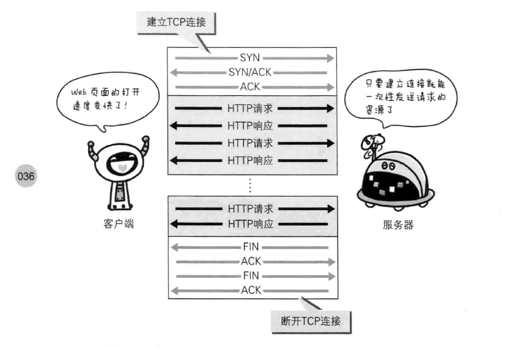
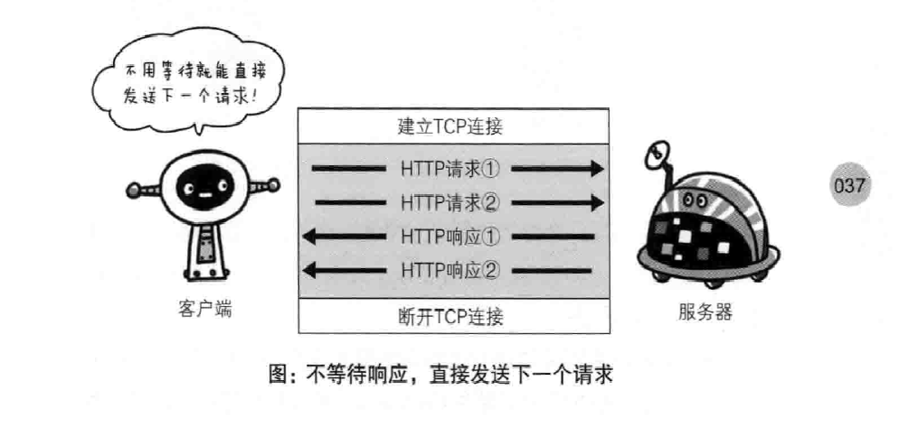

## 第二章 简单的HTTP协议

[TOC]

### 2.1 客户端和服务端之间的通信

HTTP协议是基于客户端和服务端之间的通信

### 2.2 通过请求和响应的交换达成通信

请求必定是从客户端发出，服务端响应请求并返回。HTTP协议不支持双向通信，WebSocket协议支持。

客户端请求报文：

```
POST /form/entry HTTP/1.1
Host: example.com
Connection: keep-alive
Content-Type: application/x-www-form-urlencoded
Content-Length: 16
name=ueno&age=37
```

服务端响应报文：

```
HTTP/1.1 200 OK
Date: Tue， 10 Jul 2012 06:50:15 GMT
Content-Length: 362
Content-Type: text/html

<html>
...
```

### 2.3 HTTP是不保存状态的协议

HTTP协议自身不保存请求和相应之间的通信状态。可以使用cookie来保存状态信息。

### 2.4 请求URI定位资源

URI可以定位互联网上的所有资源。

```
GET /index.html HTTP/1.1
Host: example.com
```

### 2.5 与服务端交互的方法

- GET：访问已经被URI识别的资源，指定的资源被解析之后，返回响应的内容。

```
GET /index.html HTTP/1.1
Host: example.com
-------------------------
返回index.html的页面资源

GET /index.html HTTP/1.1
Host: example.com
If-Modified-Since: Thu, 12 Jul 2012 07:30:00 GMT
-------------------------------------------------------
仅返回2012年7月12日07:30:00以后更新过的index.html的页面资源
如果没有内容更新，返回状态码 304 Not Modified
```

- POST：传输客户端的数据

```
POST /submit.cgi HTTP/1.1
Host: www.example.com
Content-Length: 1560
-----------------------------
返回submit.cgi接收数据的处理结果
```

- PUT：指定URI上传文件，自身没有验证机制，一般不开放。REpresentational State Transfer标准的Web网站可能会开放。

```
PUT /example.html HTTP/1.1
Host: www.example.com
Content-Type: text/html
Content-Length: 1560
-----------------------------------------
返回状态码 204 No Content（表示该文件已存在）
```

- HEAD：除了不返回报文主体部分，其它和GET方法一样。用于确认URI的有效性和资源的更新时间。

```
HEAD /example.com HTTP/1.1
Host: www.example.com
--------------------------
返回index.html的响应首部
```

- DELETE：删除指定URI上的文件

```
DELETE /example.com HTTP/1.1
Host: www.example.com
---------------------------------------------
返回状态码 204 No Content（表示该html已经被删除）
```

- OPTIONS： 返回针对URI指定资源支持的方法

```
OPTIONS /example.com HTTP/1.1
Host: www.example.com
--------------------------------------------------
HTTP/1.1 200 OK
Allow: GET, POST, HEAD, OPTIONS(返回服务器指定的方法)
```

- TRACE：追踪路径，因为Cross-Site Tracing Attack，基本不用

- CONNECT： 要求使用隧道协议连接代理，在隧道内使用TCP协议通信

  使用 Secure Socket Layer 和 Transport Layer Security 加密传输

  ```
  CONNECT proxy.example.com:8080 HTTP/1.1
  Host: proxy.example.com
  -----------------------------------------
  HTTP/1.1 200 OK(进入网络隧道)
  ```

### 2.6 HTTP/1.1支持的方法

| Method  | Explanation          |
| ------- | -------------------- |
| GET     | 获取资源             |
| POST    | 传输实体主体         |
| PUT     | 传输文件             |
| HEAD    | 获取报文头部         |
| DELETE  | 删除文件             |
| OPTIONS | 询问支持的方法       |
| TRACE   | 追踪路径             |
| CONNECT | 使用隧道协议连接代理 |

### 2.7 持久连接节省通信量

  在HTTP最初的设计中，每进行一次HTTP通信都要断开一次TCP连接。

  

  每个资源都要发起一次完整的HTTP请求，一个网页能需要很多次请求。

  

  持久连接：Keep-Live，只要任意一端没有明确提出断开连接，则一直保持TCP连接状态。

  

  持久连接的好处是：减少了TCP连接重复地建立和断开造成的额外开销，减轻了服务端的负载。并且降低了请求和响应时间，提高了web页面的响应速度。

管线化：不用等待服务端响应，就可以直接发送下一个请求。请求越多，响应速度提升越明显。



### 2.8 cookie

HTTP协议是无状态协议，不记录之前发生过的请求和响应状态。

Cookie技术，服务端在响应报文中添加一个Set-Cookie的首部字段信息，通知客户端保存Cookie。当下次客户端在往服务端发送请求时，客户端会自动在请求头部添加cookie后发送。服务端根据cookie查询连接记录，找到对应的连接状态。


```
GET /reader/ HTTP/1.1
Host www.example.com
---------------------------------------------------------------------------------
HTTP/1.1 200 OK
Date: Thu， 12 Jul 2012 07:12:20 GMT
Server: Apache
<Set-Cookie: sid=1342077140226724; path=/; expires=Wed, 10-Otc-12 07:12:20 GMT>
Content-Type: text/plain; charset: UTF-8
---------------------------------------------------------------------------------
GET /image/ HTTP/1.1
Host: www.example.com
Cookie: sid=1342077140226724
```