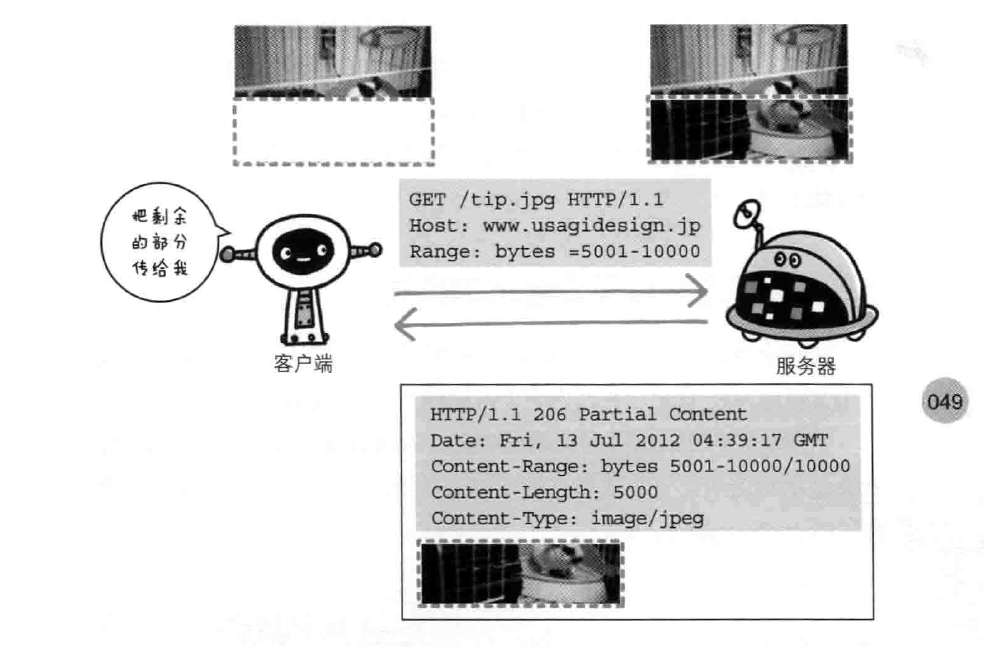

## 第三章 HTTP报文内的信息

[TOC]

### 3.1 HTTP报文

客户端发送的是请求报文，服务端发送的是响应报文。

HTTP报文有多行数据构成的字符串文本，以CR+LF作为空行分割报文头部和报文主体。

Carriage Return 回车 0x0d；Line Feed 换行 0x0a。


请求行：包含请求URI和HTTP版本

状态行：响应结果的状态码，原因短语和HTTP版本

首部字段：请求响应的各种条件和属性，通用首部、请求首部、响应首部、实体首部

### 3.2 编码提升传输速率

#### 3.2.1 报文实体

通过编码提升传输速率，但是会消耗更多的CPU资源。

HTTP报文：由8位组字节流组成，通过HTTP通信传输

实体：作为请求和响应的有效载荷数据传输

通常，报文主体和实体主体。只有在传输过程中发生编码操作时，实体主体的内容发生变化，才导致它和报文主体的内容产生差异。

#### 3.2.2 内容编码

HTTP的内容编码，指明编码格式，将实体信息压缩。最后，由客户端接收并解码。

常见的内容编码有：

- gzip （GNU Zip）
- compress (UNIX标准压缩)
- deflate(zlib)
- identity (没有编码)

#### 3.2.3 分块传输编码

传送大容量数据时，将数据分割成多块，能够让浏览器逐步显示页面，这就是分块传输编码。（Chunked Transfer Coding）

### 3.3 发送多种数据的多部分对象集合

MIME Multipurpose Internet Mail Extension 多用途互联网邮件扩展

它允许邮件处理多种不同类型的数据：文本、图片、视频等

HTTP也支持类似的协议：

multipart/form-data web表单

```
Content-Type: multipart/form-data; boudary=AaB03x

--AaB03x
Content-Disposition: form-data; name="field1"

--AaB03x
Content-Disposition: form-data; name="pics"; filename="file1.txt"
Content-Type: text/plain
/* file1.txt 的数据 */
```

multipart/byteranges 包含多个范围请求 206 Partial Content

> 要实现该功能需要制定下载的实体范围，这种制定范围发送请求叫做范围请求。


针对范围请求，服务器会返回状态码为206的报文，多重范围请求 响应会在头部 Content-Type 表明 multipart-byteranges 返回报文主体。如果服务端不支持范围请求则返回状态码200 OK并将所有报文一并返回。执行范围时会使用头部字段 Range 来指定资源 byte 的范围。

```
HTTP/1.1 200 OK
Date: Thu， 12 Jul 2012 07:12:20 GMT
Content-Type: multipart/byteranges; boundary=THIS_STRING_SEPARATES

--THIS_STRING_SEPARATES
Content-Type: application/pdf
Content-Range: bytes 500-999/8000
/* 范围数据 */
--THIS_STRING_SEPARATES
Content-Type: application/pdf
Content-Range: bytes 7000-7999/8000
/* 范围数据 */
```

### 3.4 范围请求

可以从下载的中断处恢复下载，而不是从头开始下载。实现这种功能需要指定下载的实体范围，也就是范围请求。



```
指定字节范围：
/* 5001-10000之间 */
Range: bytes=5001-10000
/* 5001以后的全部 */
Range: bytes=5001- 
/* 3000和5000-7000 */
Range: bytes=3000,5000-7000
```

如果服务端无法响应范围请求，则会返回状态码200和完整的实体内容。

### 3.5 返回最合适的内容

同一个页面可能有多个不同的版本，服务端根据实际情况返回最合适的页面。

当浏览器的默认语言是英文，则访问同一个URI返回英文的页面，而不是中文的页面。

内容协商：客户端对服务端返回的内容进行交涉，然后服务端提供最合适的资源。会有语言、字符集、编码方式的不同。

内容协商的三种方式：

- 服务端驱动协商（Server Driven Negotiation）

协商根据首部字段： Accept、Accept-Charset、Accept-Encoding、Accept-Language、Content-Language

- 客户端驱动协商（Agent Driven Negotiation）

由客户端的可选项列表里自动选择，PC版或者mobile版

- 透明协商（Transparent Negotiation）

服务端和客户端都有协商