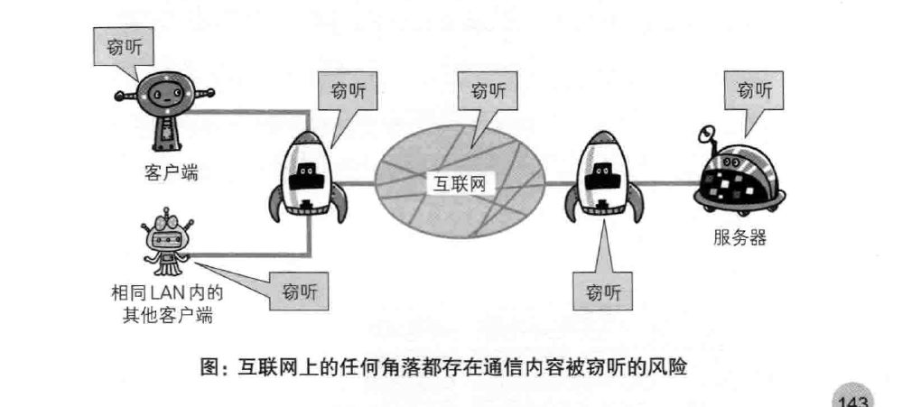
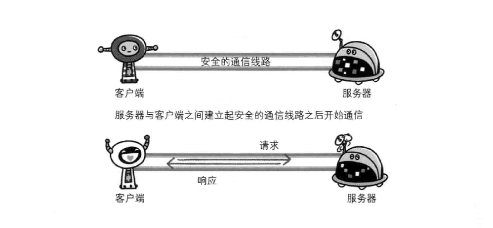
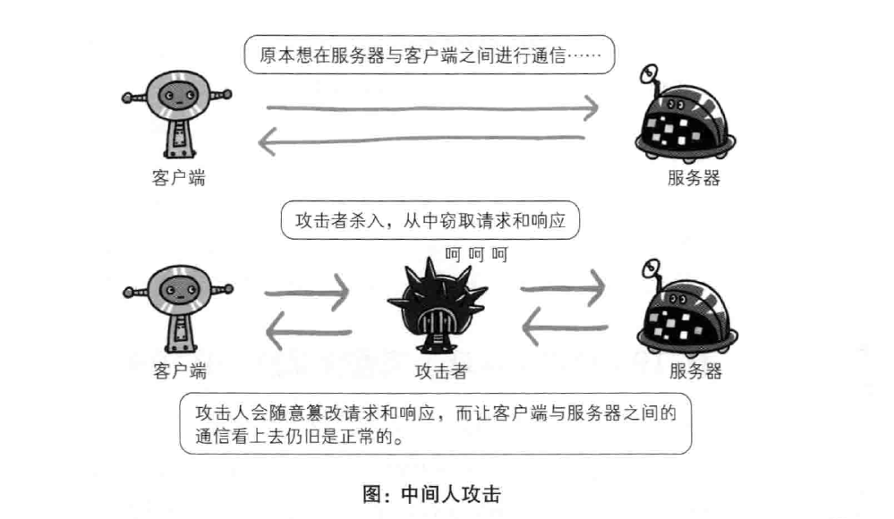
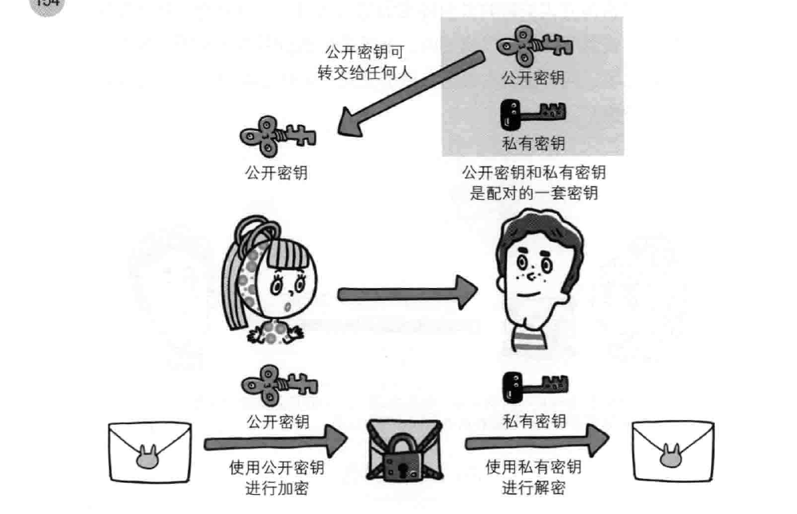
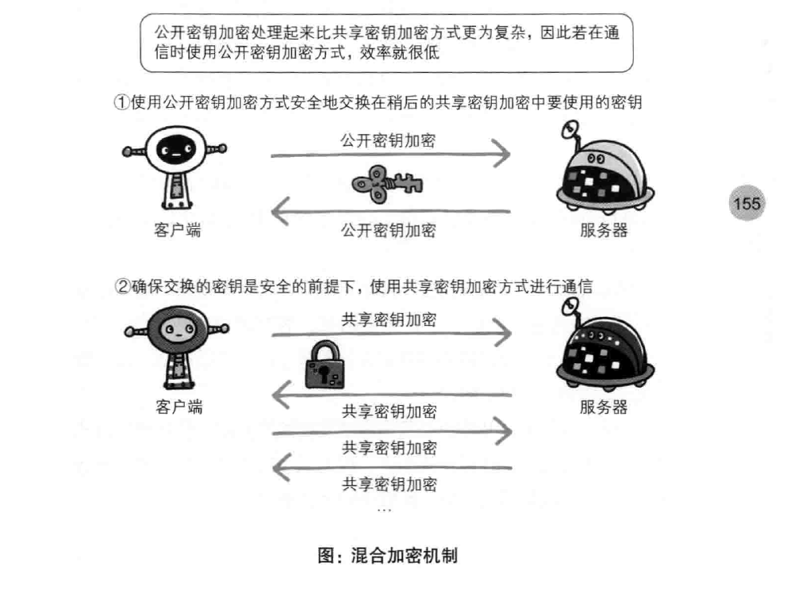
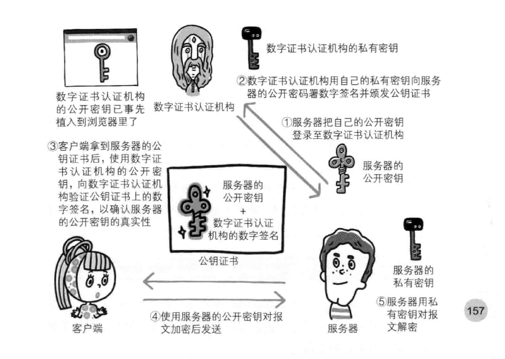
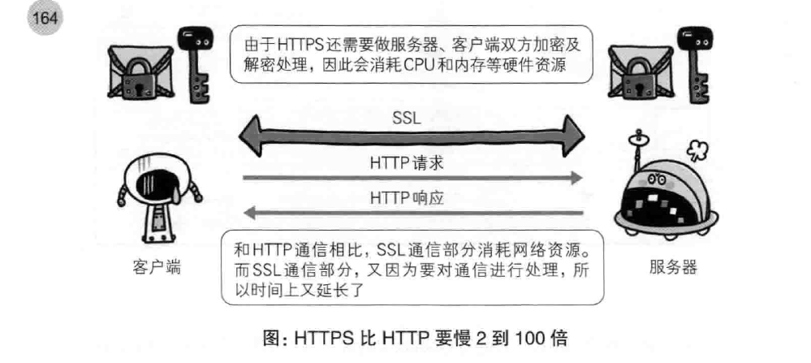

## 第七章 更安全的HTTPS

[TOC]

### 7.1 HTTP的缺点

- 通信数据明文，内容容易被窃听
- 不验证通信方身份，可能会遭遇伪装
- 无法证明报文的完整性，内容可能会被篡改

#### 7.1.1 窃听

TCP/IP协议族的每一个环节，都会遭到窃听。未加密，则窃听到明文；加密，则窃听到密文。



抓包和嗅探工具，Wireshark

解决方案，使用SSL（Secure Socket Layer）或者TLS（Transport Layer Security）建立安全通信线路，这就是HTTPS。



内容加密并不能保证安全，因为密文也是有被篡改和破译的可能。

#### 7.1.2 伪装

HTTP协议不验证请求方的身份，只要请求，都会返回一个响应。同样地，也不验证URI真正指向的主机。产生了三个隐患：

- 无法确定请求发送至目标的Web服务器是否为按真实意图返回响应的那台服务器。伪装服务器
- 无法确定响应返回到的客户端是否为按真实意图接收响应的那个客户端。伪装客户端
- 无法确定请求方是否具备访问的权限。伪装高级权限用户
- 无法判定请求来自何方
- 即使无意义的请求，也是照单全收，来者不拒。Denied of Service攻击

SSL提供了数字证书，可以用于确定通信双方。证书由值得信任的第三方颁发，用来证明服务器和客户端是实际存在的。


#### 7.1.3 篡改

HTTP协议并不能证明报文的完整性，在报文传输的过程中，报文内容可能遭到第三方的篡改。HTTP协议无法判断，发出的报文和接收的报文是相同的。中间人攻击（Man-in-the-Middle attack）



虽然HTTP协议有确认报文完整性的方法，但是并不可靠。网站可能会使用PGP（Pretty Good Privacy）和MD5校验，但是也不能百分之百保证数据的完整性。

### 7.2 HTTPS

HTTPS = HTTP + 通信加密 + 证书认证 + 完整性保护

#### 7.2.1 HTTPS是身披SSL外壳的HTTP

HTTPS：HTTP先和SSL层通信，SSL再和TCP通信。


#### 7.2.2 加密方式

对称密钥加密（共享密钥加密），加密和解密都是同一个密钥。


对称密钥加密方式的弊端：

- 不能安全地将密钥告诉接收者
- 攻击者拿到密钥就能破译
- 双方都要确保密钥的安全

非对称加密（公开密钥加密），发送方使用公钥加密，接收方使用私钥解密。私钥只有自己知道，公钥任何人都可以获取。



非对称加密，不需要发送解密的密钥，安全性很高，但是解密运算量较大。

#### 7.2.3 HTTP使用混合加密方式

非对称密钥加密更安全，加密解密速度慢；对称加密传输密钥不方便，加密解密速度快。

HTTPS两种加密方式混用：在交换密钥环节使用非对称加密，通信建立之后，在报文交换环节使用对称加密。



#### 7.2.4 如何证明公钥的正确

非对称加密，无法避免公钥被篡改。解决方案是，使用可信任的第三方机构提供的公钥证书。

具体流程是：

1. 服务端向证书认证机构申请公开密钥；
2. 证书认证机构验证身份之后，对申请的公钥做数字签名证书，然后将证书和公钥绑定在一起发给服务端
3. 服务端将该证书发给客户端，尝试进行加密通信
4. 客户端根据内部植有的证书认证机构的数字签名证书，向证书认证机构发起加密通信，求证服务端的证书
5. 证书认证机构确认证书可信
6. 客户端使用可信的公钥加密数据，和服务端通信



#### 7.2.5 SSL证书

- 可证明组织真实性的EV SSL证书（Extended Validation SSL Certificate）

拥有EV SSL证书， 浏览器的状态栏不仅有绿色的锁标记，还有证书所属组织名称。

- 客户端证书

客户端证书和服务端证书的作用是类似的，它是为了验证客户端的身份。每个客户端都需要安装，意味着巨大的安装成本。另外，客户端证书只是验证了客户端的真实存在，并不能验证使用者身份的真实有效。那么，安装客户端证书的人，就拥有了客户端证书的使用权限。

这些缺陷限制了客户端证书的使用范围，只有少数对安全性要求极高的业务才会使用客户端证书，如：网上银行。

- 自签名证书

自签名证书由于没有获取第三方证书认证机构的认证，无法消除伪装的可能性，浏览器并不认可，并且会提示网站有安全风险。有些中级签名证书，也会被浏览器判定存在风险。

### 7.3 HTTPS通信

#### 7.3.1 通信过程

```sequence
Note right of Client: Connection Start
Client->Server: (1)HandShake: ClientHello
Server-->Client: (2)HandShake: ServerHello
Server-->Client: (3)HandShake: Certificate
Server-->Client: (4)HandShake: ServerHelloDone
Client->Server: (5)HandShake: ClientKeyExchange
Client->Server: (6)ChangeCipherSpec
Client->Server: (7)HandShake: Finished
Server-->Client: (8)ChangeCipherSpec
Server-->Client: (9)HandShake: Finished
Note right of Client: Connection Established
Client->Server: (10)Application Data via HTTP
Server-->Client: (11)Application Data via HTTP
Note right of Client: Connection close
Client->Server: (12)Alert: Warning, close notify
```

ClientKeyExchange以服务端发来的公钥加密， 传输一个Pre-Master secret的随机密码串。

ChangeCipherSpec报文告诉服务端，接下来的报文会用Pre-Mater secret为密钥加密。

Finished报文包含连接开始至今全部报文的校验值，客户端和服务端的Finished报文交换完毕，SSL才算建立完成。

应用层发送数据时，会附带MAC（Message Authentication Code）的报文摘要，如果报文被篡改，MAC会改变。

#### 7.3.2 SSL速度慢

使用SSL速度变慢有两个方面的原因：

- 数据传输慢，额外的数据包
- 加密解密运算，额外的运算开销

