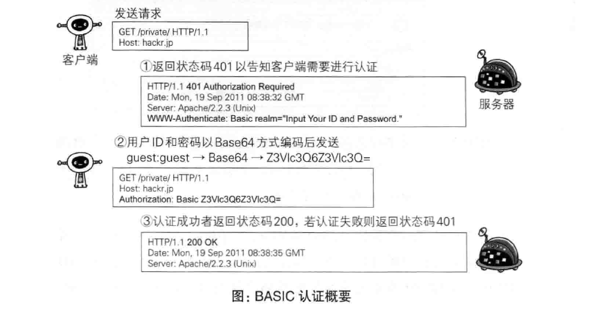
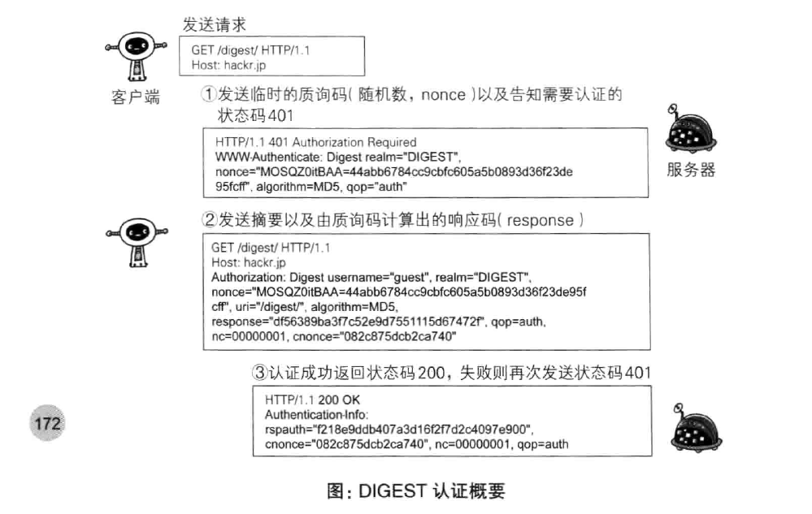
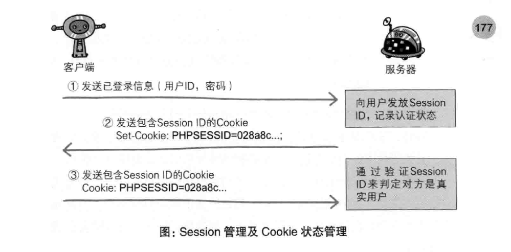

## 第八章 用户访问认证

[TOC]

### 8.1 何为认证

计算机验证用户的身份的凭据有：

- 密码：注册账户时，提交的用户验证身份的字符串
- 动态令牌：本人持有的设备上才有的一次性密码
- 数字证书：用户持有的终端携带的身份证明
- 生物认证：指纹、虹膜、面部
- IC：带有数字芯片的卡片

对于计算机而言，只要能通过验证，就认为是本人。因此，验证信息绝不能泄露。

HTTP所使用的认证方式有：

- BASIC认证，基本认证
- DIGEST认证，摘要认证
- SSL客户端认证
- FormBase认证，表单认证

### 8.2 BASIC认证

```sequence
Client->Server: GET / HTTP/1.1<CR> Host: example.com
Note left of Server: XXX: input your id and password
Server-->Client: HTTP/1.1 401 Authorization Required<CR> WWW-Authenticate: Basic realm="XXX"
Client->Server: GET / HTTP/1.1<CR> Host: example.com<CR> Authorization: Basic YYY
Note right of Client: YYY: id and password
Server-->Client: HTTP/1.1 200 OK
```



Basic认证明文传输密码，安全度几乎为零 。另外Basic认证只有登录，没有注销。所以目前，几乎没有网站使用这种认证。

### 8.3 DIGEST认证

DIGEST使用质询响应的方式，没有传输明文密码。

质询响应：认证方发送质询码，接收方计算出响应码返回。



WWW-Authenticate首部字段必须包含realm和nonce值，nonce是随机字符串，realm是Response-URI安全域字符串。

Authorization：必须包含username、realm、nonce、uri和response字段信息。response是密码的MD5值，username是realm限定范围内的用户名。uri就是Request-URI。

认证成功后，Authentication-Info会写入认证成功的相关信息。

### 8.4 SSL客户端认证

凭借SSL客户端认证，服务端可以确认客户端是否可信。

1. 客户端安装SSL证书
2. 客户端请求资源，服务器发送Certificate Request报文，要求客户端提供客户端证书
3. 客户端发送客户端证书，Client Certificate报文
4. 服务端验证证书是否可信，取出可信证书的公钥，进行HTTPS通信

实际上，采用SSL客户端认证的情况下，还要求认证者提供其它信息，如密码、口令等。既保证客户端可信，又确保了用户可信。

客户端认证需要支付的费用有：购买证书的费用，维持证书运营的费用。

### 8.5 表单认证

用户以表单的形式发送用户id和密码等登录信息到服务端的认证方式。

目前，最常见的认证还是表单认证。Baisc、Digest认证安全性不高，SSL客户端认证成本很高。

表单认证会使用Cookie来管理Session。因为HTTP是无状态的协议，认证过的客户端，再发起请求时，服务端并不能辨别。使用Cookie就可以实现状态管理。



cookie中的SessionID是用户的标志，如果SessionID被盗，第三方就可以伪装成已认证用户进行操作。

另外，服务端也不能明文保存用户密码，一种安全的做法是：先给密码增加额外信息(salt)，然后计算其hash函数算出散列值保存。

>salt是服务器随机生成的字符串，长度足够长，并且是真正随机生成的，然后将其和密码字符串相连接生成散列值。当两个用户使用了同一个密码时，也会因为salt值不同，生成的散列值也不同。这样就可以减少密码特征，攻击者很难用密码特征库进行破解。