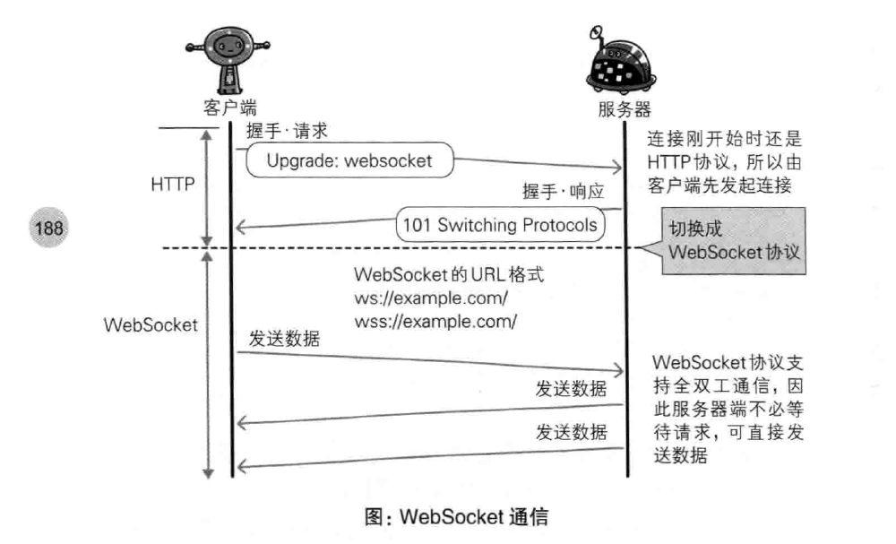

## 第九章 基于HTTP功能的追加协议

[TOC]

HTTP在功能和性能上已经不能满足现在的需求。

### 9.1消除HTTP瓶颈的spdy

SPDY没有改写HTTP协议，只是在TCP/IP的应用层和传输层之间添加一个会话层。为了确保安全，SPDY规定通信过程必须使用SSL。

使用SPDY之后，HTTP协议额外获取了：


- 多路复用： 所有的HTTP请求都使用同一个TCP连接
- 并发请求：请求可以无限并发，并且可以规定优先级
- 压缩HTTP首部： 压缩HTTP的首部，传递同样的数据，报文数减少了
- 推送功能： 支持服务端主动向客户端推送数据，而不必等待客户端的请求
- 服务器提示功能：主动提示客户端可以获取的资源，避免了不必要的请求

SPDY只能以IP为单位，进行通信上的多路复用，一个IP多个域名，改善效果就不明显。

### 9.2 全双工通信的WebSocket

Ajax技术： web页面局部更新的异步通信手段，Ajax可以实时地从服务端获取更新内容。

Comet技术： 服务端延迟响应客户端的请求，直到服务端有内容更新为止。

这两种技术并不能从根本上解决HTTP的问题。WebSocket就是为了解决这个问题而诞生的。

一旦客户端和服务端建立WebSocket连接，以后所有的通信都通过WebSocket传输，数据可以是：JSON，XML，HTML、image等任意格式的数据。WebSocket协议有以下特点：

- 推送功能：支持服务端推送数据
- 减少了通信量：一旦建立WebSocket通信，连接就一直保持，通信量减少了

WebSocket通信的建立

为了实现WebSocket的通信，需要使用HTTP协议的Upgrade首部，告知服务端通信协议改变。

```
GET /chat HTTP/1.1
Host: example.com
Upgrade: websocket
Connection: Upgrade
Sec-Websocket-Key: dGhlIHNhbXBsZSBub25jZQ==
Origin: http://example.com
Sec-Websocket-Protocol: chat, superchat
Sec-Websocket-Version: 13
```

Sec-Websocket-Key记录着通信键值，Sec-Websocket-Protocol记录了使用的子协议。

服务端返回101 Switching Protocols响应

```
HTTP/1.1 101 Switching Protocols
Upgrade: websocket
Connection: Upgrade
Sec-Websocket-Accept: s3PLMBiTxaQ9kYGzzhZRbK+XOo=
Sec-Websocket-Protocol: chat
```

Sec-Websocket-Accept的值是由Sec-Websocket-Key字段值生成的，握手成功之后，使用WebSocket独立的数据帧。



### 9.3 HTTP 2.0

HTTP围绕7项技术进行讨论（AD 2011）

- 压缩
- 多路复用
- 协商
- 客户端拉曳/服务器推送
- 流量控制
- WebSocket